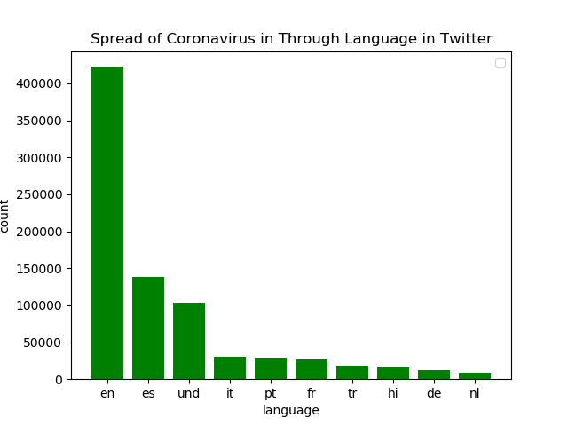
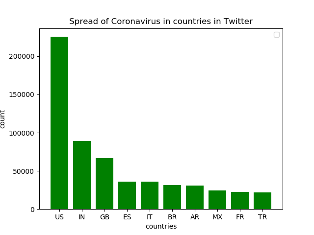
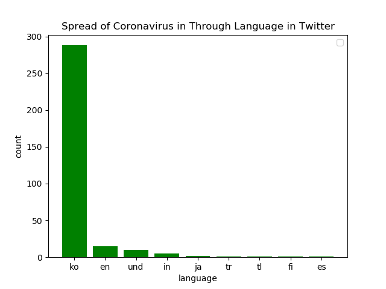
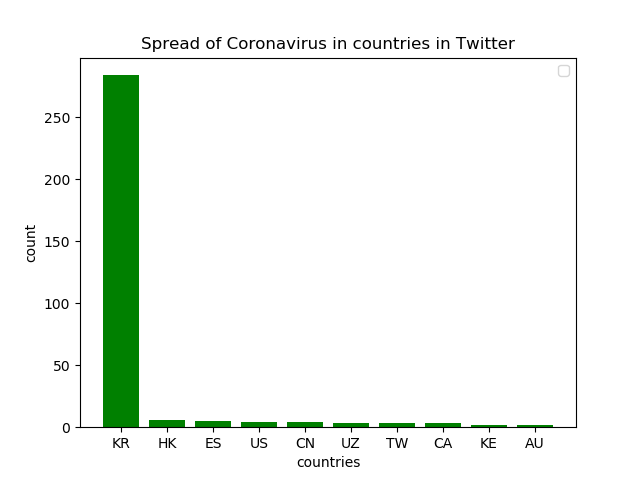

# The spread of Coronavirus on Twitter

## What?

This project uses a input data all geotagged tweets from the year 2020 to determine the frequency of different hashtags across different languages, countries, and times during the first year of the pandemic. 


## How?
To do this this I ran the command

```
python3 ./src/map.py --input_path=/data/Twitter\ dataset/geoTwitter20-01-01.zip
```

to run the [maps.py](maps.py) file. This file goes through a day's worth of geotagged tweets and obtains the creates a couple of files for the given day [geoTwitter20-01-01.zip.lang](outputs/geoTwitter20-001-01.zip.lang) and [geoTwitter20-01-01.zip.country](outputs/geoTwitter20-001-01.zip.country). These two files contain the use of the hashtags in each country and language in that particular day.


To get this for all days of the year and not just January 1st, I created the [runmaps.sh](runmamps.sh) file that runs the [maps.py](src/maps.py) file on every the zip files corresponding to every day of the year. To run this file I used the command

```
nohup sh runmaps.sh &
```

After running this command I closed my computer, went to sleep and let the program run in the background.


After obtaining all the files for each day.  The commands

```
python3 ./src/reduce.py --input_paths outputs/geoTwitter20-*.lang --output_path=reduced.lang
```
and 

```
python3 ./src/reduce.py --input_paths outputs/geoTwitter20-*.country --output_path=reduced.country
```
consolidated the information from the outputs folder into two files  [reduced.lang](reduced.lang)  [reduced.country](reduced.country). The  [visualize.py](src/visualize.py) file uses matplotlibs to graph the distribution of the use of a given hashtag across the top 10 most frequent countries or languages depending on the input file. 










